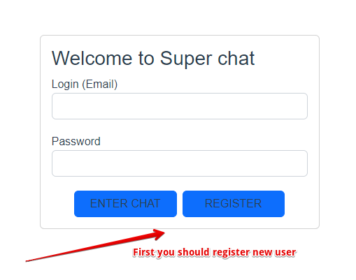
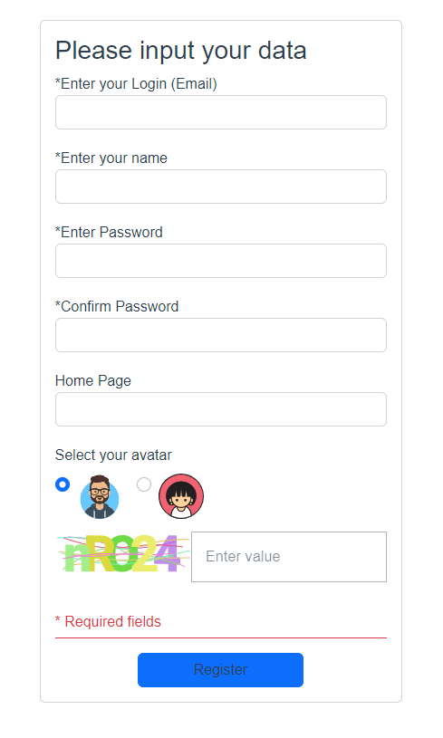
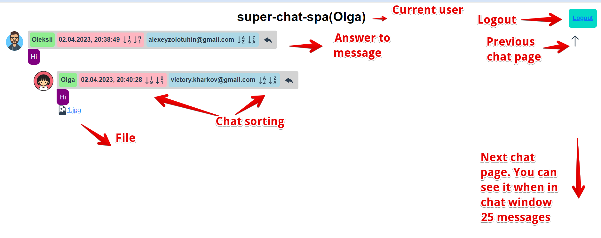
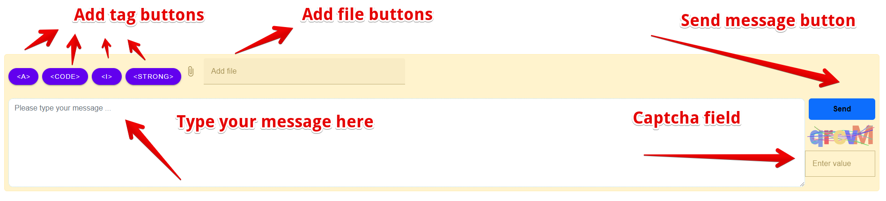

# super_chat

1. Download Docker image:   `docker pull alexeyzolotuhin/super_chat_spa`
2. Creates and run Docker container: `docker run -p {port}:3300 --name super_chat alexeyzolotuhin/super_chat_spa`
    where _port_ - local port on which you want to start app. For example 3300:3300
3. Open in browser `http://localhost:{port}`

## Login form

## Register form

## Chat window (messages part)

## Chat window (control part)

